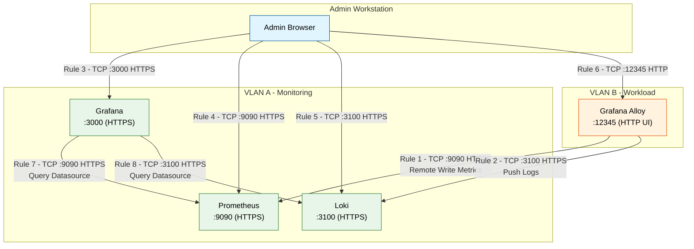

# Firewall Rules for Monitoring Stack

## Overview
- **VLAN A (Monitoring):** Prometheus, Grafana, Loki
- **VLAN B (Workload):** Grafana Alloy agents
- **Admin IP:** `<YOUR_ADMIN_IP>` (replace with your actual IP/CIDR)
- **Protocol:** HTTPS on all services (no reverse proxy, no gRPC)
- **Self-signed certs:** Set `insecure_skip_verify = true` in Alloy, or load your CA cert

---

## Cross-VLAN Rules (Alloy → Monitoring Stack)

| Rule # | Source | Destination | Protocol | Port | Direction | Purpose |
|--------|--------|-------------|----------|------|-----------|---------|
| 1 | VLAN B (Alloy) | VLAN A (Prometheus) | TCP | 9090 | One-way → | Alloy remote-writes metrics to Prometheus over HTTPS |
| 2 | VLAN B (Alloy) | VLAN A (Loki) | TCP | 3100 | One-way → | Alloy pushes logs to Loki over HTTPS |

---

## Admin Access Rules (Admin IP → Monitoring Stack)

| Rule # | Source | Destination | Protocol | Port | Direction | Purpose |
|--------|--------|-------------|----------|------|-----------|---------|
| 3 | Admin IP | VLAN A (Grafana) | TCP | 3000 | One-way → | Admin browser access to Grafana UI over HTTPS |
| 4 | Admin IP | VLAN A (Prometheus) | TCP | 9090 | One-way → | Admin browser access to Prometheus UI over HTTPS |
| 5 | Admin IP | VLAN A (Loki) | TCP | 3100 | One-way → | Admin API/browser access to Loki over HTTPS |

---

## Admin Access Rules (Admin IP → Alloy)

| Rule # | Source | Destination | Protocol | Port | Direction | Purpose |
|--------|--------|-------------|----------|------|-----------|---------|
| 6 | Admin IP | VLAN B (Alloy) | TCP | 12345 | One-way → | Alloy built-in UI (health, components, config, debug) |

> **Note:** Port 12345 is the default. Check your Alloy config for `--server.http.listen-addr` if customised.

---

## Intra-VLAN Rules (Monitoring Stack Internal)

> **Note:** Only required if intra-VLAN traffic is restricted by firewall. If components are on the same subnet with no internal filtering, these can be ignored.

| Rule # | Source | Destination | Protocol | Port | Direction | Purpose |
|--------|--------|-------------|----------|------|-----------|---------|
| 7 | Grafana | Prometheus | TCP | 9090 | One-way → | Grafana queries Prometheus datasource over HTTPS |
| 8 | Grafana | Loki | TCP | 3100 | One-way → | Grafana queries Loki datasource over HTTPS |

---

## Port Summary

| Port | Service | Required Rules |
|------|---------|----------------|
| 3000 | Grafana UI (HTTPS) | Admin IP → VLAN A (Rule 3) |
| 9090 | Prometheus UI & Remote Write (HTTPS) | Admin IP → VLAN A (Rule 4), VLAN B → VLAN A (Rule 1) |
| 3100 | Loki Ingestion & Query (HTTPS) | Admin IP → VLAN A (Rule 5), VLAN B → VLAN A (Rule 2) |
| 12345 | Alloy UI (HTTP) | Admin IP → VLAN B (Rule 6) |

---

## Traffic Flow Diagram

See separate file: `diagram.mermaid`

---

## Alloy Configuration

See separate file: `config.alloy`

---

## Loki Configuration

See separate file: `loki-config.yaml`

---

## Implementation Checklist

- [ ] Replace `<YOUR_ADMIN_IP>` with actual IP/CIDR
- [ ] Generate TLS certs for Loki (Prometheus & Grafana already done)
- [ ] Place CA cert on Alloy hosts if using internal CA, or set `insecure_skip_verify = true` for self-signed
- [ ] Apply Rules 1-2 for Alloy data flow
- [ ] Apply Rules 3-5 for admin UI access to monitoring stack
- [ ] Apply Rule 6 for admin access to Alloy agents
- [ ] Apply Rules 7-8 only if intra-VLAN filtering is active
- [ ] Test metrics flow: Alloy → Prometheus (`curl -v https://prometheus:9090/api/v1/write`)
- [ ] Test logs flow: Alloy → Loki (`curl -v https://loki:3100/ready`)
- [ ] Test admin access to all UIs (Grafana, Prometheus, Loki, Alloy)


## Alloy Config

```alloy
prometheus.remote_write "metrics" {
  endpoint {
    url = "https://prometheus.your-domain.com:9090/api/v1/write"

    tls_config {
      # Set to true if using self-signed certs
      insecure_skip_verify = false
      # Or provide your CA cert:
      # ca_file = "/etc/alloy/certs/ca.crt"
    }

    basic_auth {
      username = "alloy-metrics"
      password = "<METRICS_PASSWORD>"
    }
  }
}

loki.write "logs" {
  endpoint {
    url = "https://loki.your-domain.com:3100/loki/api/v1/push"

    tls_config {
      # Set to true if using self-signed certs
      insecure_skip_verify = false
      # Or provide your CA cert:
      # ca_file = "/etc/alloy/certs/ca.crt"
    }

    basic_auth {
      username = "alloy-logs"
      password = "<LOGS_PASSWORD>"
    }
  }
}
```

```yaml
server:
  http_listen_port: 3100
  grpc_listen_port: 0  # gRPC disabled

  http_tls_config:
    cert_file: /etc/loki/certs/loki.crt
    key_file: /etc/loki/certs/loki.key

auth_enabled: true

ingester:
  lifecycler:
    ring:
      kvstore:
        store: inmemory
      replication_factor: 1

schema_config:
  configs:
    - from: 2024-01-01
      store: tsdb
      object_store: filesystem
      schema: v13
      index:
        prefix: index_
        period: 24h

storage_config:
  filesystem:
    directory: /loki/data

limits_config:
  allow_structured_metadata: true
```
